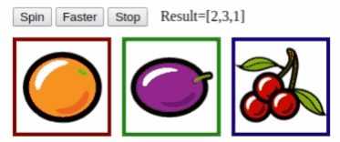

# stencil-slot-machine
A web component compiled with StencilJS to simulate a slot machine spin effect



Based on this codepen [CSS Slot Machine (transition)](https://codepen.io/alberto-carvalho/pen/zYOXKaO).

## Cloning the repository

```
$ git clone https://github.com/albertorcf/stencil-slot-machine.git
$ cd stencil-slot-machine/
$ npm install
$ npm start
```
